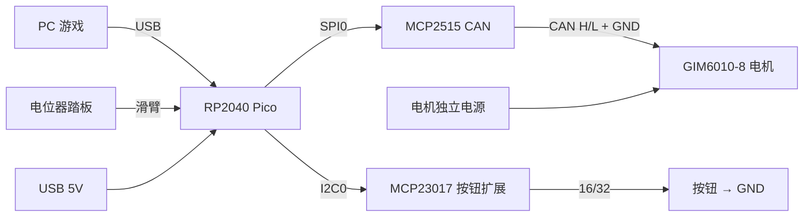

# 硬件接线指南

RP2040 (Pico) + MCP2515 CAN + GIM6010-8 电机 +（可选）MCP23017 按钮 + 模拟踏板。

所有引脚均为固件默认值,可用 `-D` 覆盖(见 [README 配置参考](../README.md#配置参考-d-标志))。

---

## 系统框图

---

## 1. RP2040 ↔ MCP2515（SPI0）

| MCP2515 模块 | Pico 引脚 | GPIO | 说明 |
|---|---|---|---|
| VCC | 见下方 ⚠️ | — | 电平问题,别直接 5V 进 Pico |
| GND | GND | — | |
| SCK | SPI0 SCK | **GP18** | Pico 输出 |
| SI (MOSI) | SPI0 TX | **GP19** | Pico 输出 |
| SO (MISO) | SPI0 RX | **GP16** | 模块输出 → Pico 输入 ⚠️ |
| CS | — | **GP17** | Pico 输出 |
| INT | 不接 | — | 固件用轮询模式,无需中断 |

> ⚠️ **5V 电平陷阱(必看)**
> 常见蓝色 MCP2515 模块上的收发器(TJA1050)需要 **5V** 供电,而 **RP2040 GPIO 不耐 5V**。
> `SCK/SI/CS` 是 Pico → 模块的输出(3.3V,MCP2515 能识别,没问题);唯一从模块进 Pico 的是
> **SO(MISO)→ GP16**,它在 5V 供电时是 5V 电平,会损伤 Pico。三种处理:
> 1. **整块 3.3V 供电**(最简单):MCP2515 芯片 OK;TJA1050 低于 4.75V 可能勉强,短线/500k 多数可用,长线不稳。
> 2. **5V 供电 + 只在 SO→GP16 上做电平转换**(分压电阻或电平转换芯片)——最稳。
> 3. 用**双电源版模块**(MCP2515 逻辑 3.3V、收发器 5V)。
>
> **晶振**:固件默认 `MCP_OSC_HZ=8000000`(8 MHz)。若你的模块是 16 MHz,编译时加 `-DMCP_OSC_HZ=16000000`。

---

## 2. MCP2515 ↔ 电机（CAN 总线）

| MCP2515 | GIM6010-8 CAN | 说明 |
|---|---|---|
| CANH | CANH | |
| CANL | CANL | |
| **GND** | **CAN GND / 电源地** | ⚠️ **必须连**,见下 |

> ⚠️ **CAN 必须共地**:CAN 是差分但**非隔离**。两端各自独立供电时,若两地不连,共模电压会漂出收发器
> 范围 → 间歇丢帧 / 进 bus-off。**务必用一根参考地线把 MCP2515 地和电机 CAN 地连起来。**
>
> ⚠️ **终端电阻 120Ω**:CAN 总线两端各一个(电机内通常已内置一个,MCP2515 模块常带一个跳线/贴片)。
> 断电量 CANH–CANL 之间应约 **60Ω**。只终端一端或都不终端都会反射出错。

**电机侧 CAN 参数**(在 ODrive/电机侧配置,不是固件):
- `node_id = 1`(BL72 出厂默认;固件默认 `ODRIVE_NODE_ID=1`)
- 波特率 `500k`(固件默认 `MCP_BAUD=500000`)
- 编码器广播 `encoder_msg_rate_ms ≈ 1`,心跳默认 100ms

---

## 3. RP2040 ↔ MCP23017（I2C0,按钮,可选)

需 `-DBUTTON_CHIPS=1`(16 键)或 `2`(32 键)。

| MCP23017 | Pico | GPIO | 说明 |
|---|---|---|---|
| VDD | 3V3(OUT) | — | 用 3.3V,I2C 才能直连 Pico |
| VSS | GND | — | |
| SDA | I2C0 SDA | **GP20** | 需 ~4.7k 上拉到 3V3 |
| SCL | I2C0 SCL | **GP21** | 需 ~4.7k 上拉到 3V3 |
| **RESET** | 3V3 | — | ⚠️ 低有效,**必须拉高**,否则芯片一直复位 |
| A0/A1/A2 | GND 或 3V3 | — | 设 I2C 地址,见下 |
| INTA/INTB | 不接 | — | 固件用轮询 |
| GPA0–7 / GPB0–7 | → 按钮 → GND | — | 每个按钮一端接引脚、一端接 GND |

**地址设定**(A2 A1 A0):
- 芯片 0:`A2=A1=A0=GND` → `0x20`(= `BUTTON_ADDR0`)
- 芯片 1:`A0=3V3`,A1=A2=GND → `0x21`(= `BUTTON_ADDR1`)

> 按钮无需外部电阻(片内上拉已开,松开=高、按下=接地为低)。
> MCP23017 若用 5V 供电,其 SDA/SCL **不要**直连 Pico(非 5V 耐受)——用 3.3V 供电最省心。

---

## 4. RP2040 ↔ 踏板（ADC,可选)

需 `-DPEDAL_COUNT=3`。电位器式踏板:

| 踏板 | 电位器接法 | Pico ADC | GPIO | HID 轴 |
|---|---|---|---|---|
| 油门 | 两端 3V3(OUT) / GND,滑臂 → | ADC0 | **GP26** | Y |
| 刹车 | 同上 | ADC1 | **GP27** | Z |
| 离合 | 同上 | ADC2 | **GP28** | Rx |

> ⚠️ **ADC 脚不耐 5V**(RP2040 全脚;RP2350 的 GP26–29 也不耐)。
> - 被动电位器:两端接 **3V3(OUT)** 和 GND,滑臂进 ADC —— **不要接 5V**。
> - 有源 0–5V 传感器:分压到 0–3.3V,或用外部 ADC(如 ADS1115 走 I2C)。
> - 不接的踏板务必调低 `PEDAL_COUNT`;悬空 ADC 脚会因噪声被自动量程误标定。
>
> 标定:上电后每个踏板**踩到底再松开一次**,自动量程即完成。反向接线的踏板用 `-DPEDAL_INVERT_MASK`。

---

## 5. 供电与地

| 供电对象 | 来源 | 备注 |
|---|---|---|
| Pico | USB 5V(来自 PC) | 逻辑侧 |
| 电机 | **独立电源** | 电机大电流,别和 Pico 共电源轨 |
| MCP2515 / MCP23017 | Pico 的 3V3(OUT) 或 5V | 见各节电平注意 |

> **单点共地(星形地)**:电机电源地、MCP2515 地、Pico 地 三者需有共同参考,但电机大电流的回流
> **不要**经过 Pico 的 USB 地。CAN 那根共地线就是关键的参考连接(见第 2 节)。
> Pico 的 5V/3V3 就近加电容(几百 µF + 0.1µF)抗电机换向噪声。

---

## 完整引脚占用表(RP2040 / Pico)

| GPIO | 用途 | 方向 |
|---|---|---|
| GP16 | MCP2515 SO (MISO) | 输入 ⚠️5V |
| GP17 | MCP2515 CS | 输出 |
| GP18 | MCP2515 SCK | 输出 |
| GP19 | MCP2515 SI (MOSI) | 输出 |
| GP20 | MCP23017 SDA (I2C0) | 双向 |
| GP21 | MCP23017 SCL (I2C0) | 输出 |
| GP25 | 板载 LED(状态心跳) | 输出 |
| GP26 | 踏板 ADC0(油门) | 输入(模拟) |
| GP27 | 踏板 ADC1(刹车) | 输入(模拟) |
| GP28 | 踏板 ADC2(离合) | 输入(模拟) |
| GP0–15, GP22 | 空闲 | — |

---

## 最小系统(只做方向盘力反馈)

只需 **Pico + MCP2515 + 电机**:接第 1、2、5 节;不接 MCP23017 和踏板,保持默认
`BUTTON_CHIPS=0` / `PEDAL_COUNT=0` 即可。刷 `firmware/ffb_wheel.uf2` 上电即用。
